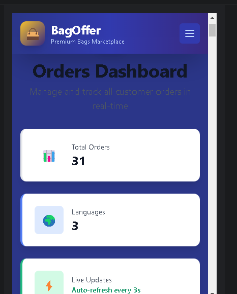
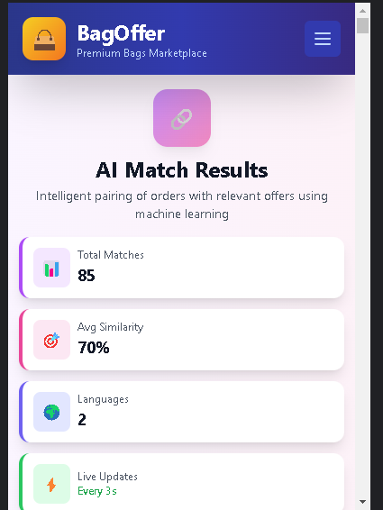
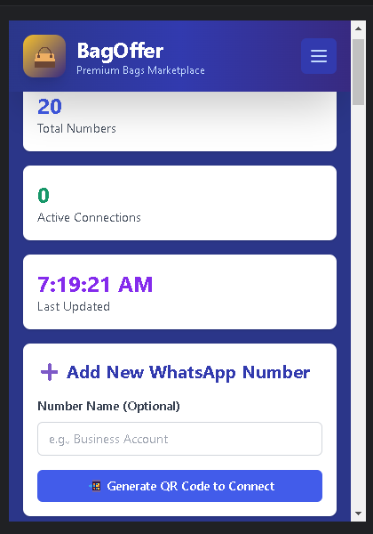
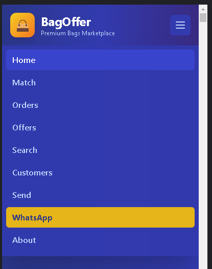
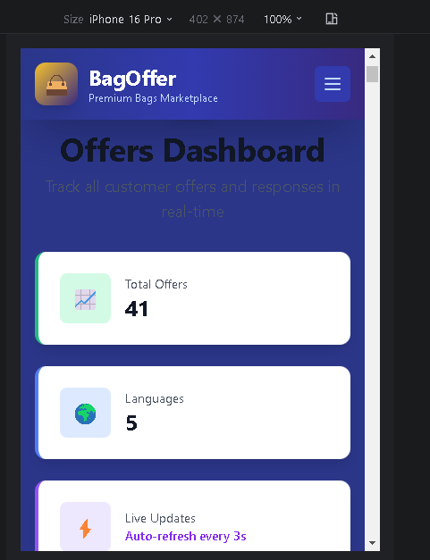
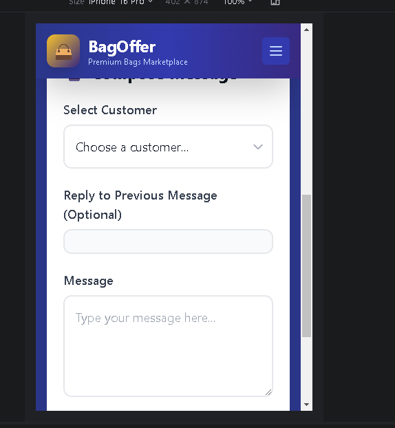

# 🤖 Multimodel AI Automation: LLM-Powered WhatsApp Business Mobile App - Offer-Order Multi-Messaging Classificaiton

An advanced AI-driven WhatsApp business automation system featuring RoBERTa transformer model for intelligent message classification, smart offer-order matching, and comprehensive mobile business management capabilities.

## Author
**Nooruddin Noonari**  
Email: noor.cs2@yahoo.com

## Co Author:
**Zeeeshan Ahmed Noonari**

## Features

### 🤖 AI-Powered Message Classification
- **RoBERTa Model Integration**: Advanced NLP model for classifying messages as offers or orders
- **Real-time Processing**: Automatic message classification using trained transformer models
- **High Accuracy**: Fine-tuned model with balanced dataset for optimal performance

### 📱 WhatsApp Integration
- **Multi-Session Support**: Handle multiple WhatsApp accounts simultaneously
- **QR Code Authentication**: Easy setup with QR code scanning
- **Message Management**: Send, receive, and process WhatsApp messages
- **Group Support**: Handle both individual and group conversations

### 🎯 Smart Matching System
- **Offer-Order Matching**: Intelligent matching between customer offers and orders
- **Category-based Classification**: Organized matching using predefined categories
- **Automated Notifications**: Send matched results to relevant parties

### 💼 Customer Management
- **Customer Database**: Store and manage customer information
- **Order Tracking**: Track customer orders and their status
- **Search Functionality**: Advanced search capabilities for customers and orders

### 🌐 Web Dashboard
- **Modern UI**: Clean, responsive web interface
- **Real-time Updates**: Live dashboard with real-time data
- **Multiple Views**: Dashboard, search, orders, customers, and matching pages
- **Mobile Responsive**: Optimized for both desktop and mobile devices

## Technology Stack

### 🚀 Backend Technologies
- **Runtime**: Node.js
- **Framework**: Express.js
- **Package Manager**: npm
- **Authentication**: Session-based authentication
- **File System**: Local file storage and processing

### 🤖 AI/ML Technologies
- **Deep Learning Framework**: Hugging Face Transformers
- **Model Architecture**: RoBERTa (Robustly Optimized BERT Pretraining Approach)
- **Model Format**: SafeTensors for secure model storage
- **Training Framework**: PyTorch
- **Python Integration**: Python scripts for ML processing
- **Model Checkpoints**: Automated model versioning and checkpointing
- **Tokenization**: Advanced tokenization with custom vocabulary

### 📱 WhatsApp Integration
- **API**: Baileys WhatsApp Web API
- **Multi-Session**: Support for multiple WhatsApp accounts
- **Authentication**: QR code-based authentication
- **Message Processing**: Real-time message handling
- **Group Support**: Individual and group conversation management

### 💾 Data Management
- **Database**: MongoDB for persistent data storage
- **File Formats**: JSON, JSONL, CSV, XLSX support
- **Data Processing**: Real-time message classification and storage
- **Session Management**: Secure session data handling

### 🌐 Frontend Technologies
- **Markup**: HTML5
- **Styling**: CSS3, Tailwind CSS
- **Scripting**: Vanilla JavaScript
- **UI Components**: Custom responsive components
- **Mobile Optimization**: Progressive Web App (PWA) features
- **Icons**: Custom icon set (192px, 512px)

### 🔧 Development Tools
- **Version Control**: Git
- **Code Quality**: ESLint configuration
- **Build Tools**: Native Node.js build system
- **Testing**: Custom test suites for ML models
- **Logging**: Comprehensive logging system

### 📊 Data Science & Analytics
- **Data Processing**: Pandas-compatible data handling
- **Model Training**: Custom training pipelines
- **Performance Metrics**: Model accuracy and performance tracking
- **Data Augmentation**: Balanced dataset creation (12k+ samples)

### 🔐 Security & Performance
- **Environment Variables**: Secure configuration management
- **Session Security**: Encrypted session storage
- **API Security**: Rate limiting and validation
- **Performance**: Optimized model inference
- **Scalability**: Multi-session architecture

## Project Structure

```
LLM_Whatpp_Offer_Order_Classifier/
├── Deep/                          # AI/ML components
│   ├── categories.csv            # Category definitions
│   ├── matcher.py               # Matching algorithm
│   └── predictors/              # ML prediction models
├── public/                       # Web interface files
│   ├── index.html              # Main dashboard
│   ├── search.html             # Search functionality
│   ├── orders.html             # Order management
│   ├── customers.html          # Customer management
│   ├── match.html              # Matching interface
│   └── whatsapp-manager.html   # WhatsApp management
├── roberta_offer_order/         # Trained RoBERTa model
├── Results/                     # Application screenshots
├── index.js                     # Main server file
├── notification.js              # Notification system
└── package.json                # Dependencies
```

## Usage Restrictions

**IMPORTANT NOTICE**: This project is proprietary and cannot be used, copied, or modified without explicit permission from the author. Installation instructions and setup details are intentionally omitted to prevent unauthorized usage. If you want to develop a similar project or use any part of this codebase, please contact the author for discussion and authorization.


## Model Information

The project uses a fine-tuned RoBERTa model specifically trained for offer/order classification:
- **Model**: `roberta-base`
- **Training Data**: Balanced dataset with WhatsApp message samples
- **Accuracy**: High precision in distinguishing offers from orders
- **Languages**: Optimized for English and Arabic text

## Screenshots

### Application Interface Gallery

<div align="center">

| Dashboard | Search | Orders |
|-----------|--------|--------|
|  |  |  |

| Customers | Matching | WhatsApp Manager |
|-----------|----------|------------------|
|  |  |  |

| Menu | Offers | Send Messages |
|------|--------|---------------|
|  |  |  |

</div>

These screenshots showcase the complete application interface including:
- Main dashboard with real-time data
- Advanced search functionality
- Order and customer management systems
- AI-powered matching interface
- WhatsApp integration and messaging capabilities

## Contributing

1. Fork the repository
2. Create a feature branch (`git checkout -b feature/amazing-feature`)
3. Commit your changes (`git commit -m 'Add amazing feature'`)
4. Push to the branch (`git push origin feature/amazing-feature`)
5. Open a Pull Request

## Security Notes

- Never commit `.env` files or sensitive credentials
- Regularly update dependencies for security patches
- Use environment variables for all sensitive configuration
- Implement proper authentication for production deployments

## Usage Restrictions

**IMPORTANT NOTICE**: This project is proprietary and cannot be used, copied, or modified without explicit permission from the author. If you want to develop a similar project or use any part of this codebase, please contact the author for discussion and authorization.

## License

This project is licensed under the MIT License - see the LICENSE file for details.

## Support

For support, email noor.cs2@yahoo.com or create an issue in the repository.

## Acknowledgments

- Hugging Face for the transformer models
- Baileys for WhatsApp Web API
- MongoDB for database solutions
- The open-source community for various tools and libraries

---

**Note**: This is a sophisticated AI-powered WhatsApp bot designed for business automation. Ensure compliance with WhatsApp's Terms of Service and local regulations when deploying.
